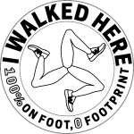

# I WALKED HERE

I WALKED HERE is a compaign for Doncaster that promotes walking as the best mode of transportation. By overiding the pervasive 100% Electric, 0 Emissions tagline often seen on electric vehicles, I WALKED HERE declares "100% On Foot, 0 Footprint".

Can we be as proud of walking somewhere as we are of driving there?

GETTING THE BADGE

How did you get here? Did you walk? Oh, then you got the badge!

REWARD FOR WALKING 

Open the Walking Tracker to record your journey to a destination of your choice and receive a minimum 10% discount on a purchase .

Track your return to the ArtBomb store to earn the I WALKED HERE badge!

I WALKED HERE is an artwork by Inari Wishiki.
Commissioned by ArtBomb 

